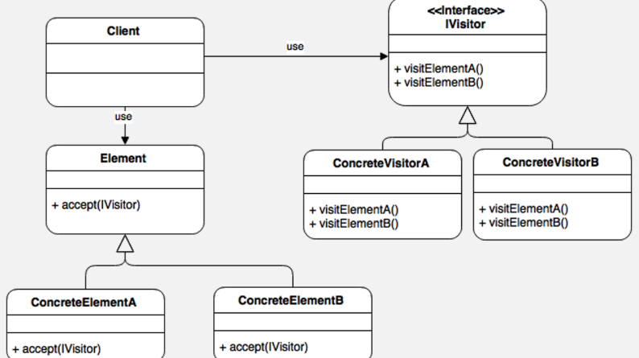

# Visitor pattern

더블 디스패치 (Double Dispatch)를 활용할 수 있다.
- 메서드 디스패치를 두 번 사용하여 유연성을 높이는 것인데, Visitor pattern에서 사용되는 기법이다
- [토비의 봄 TV 1회 - 재사용성과 다이나믹 디스패치, 더블 디스패치](https://www.youtube.com/watch?v=s-tXAHub6vg&t=2732s)

